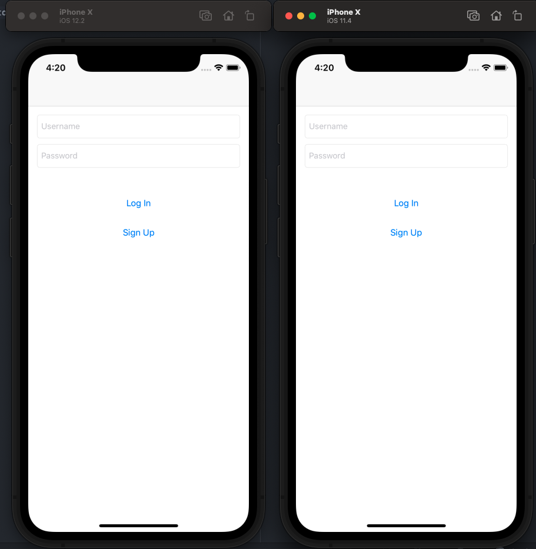
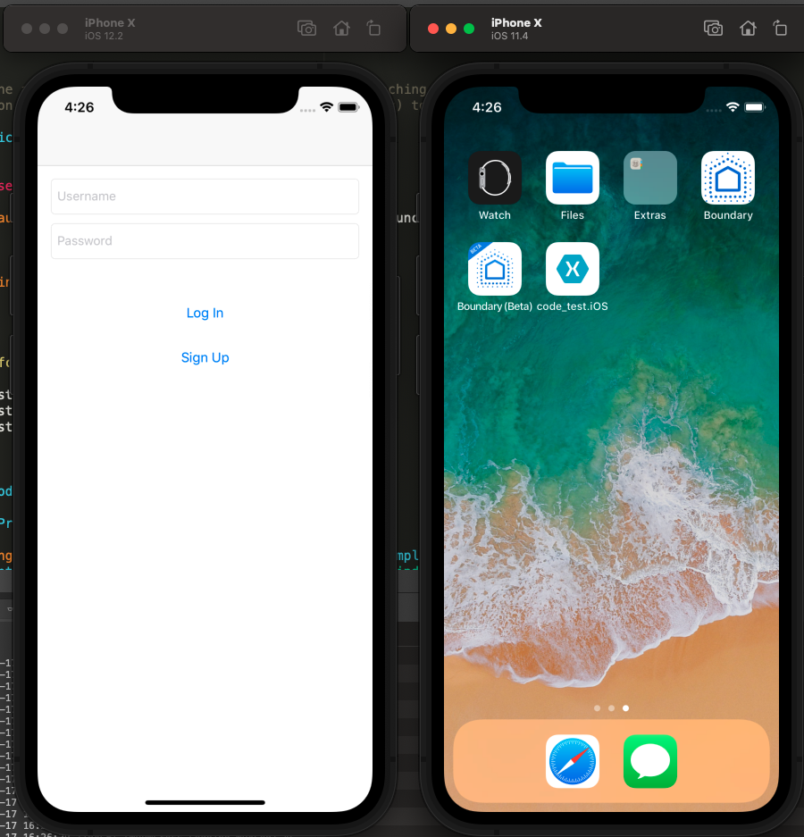

# Boundary Test project

1. Run Master on iOS Simulators iPhone X 12.2; iPhone X 11.4

Display: 

2. Pull and Run the branch: crash/instabug on iOS Simulators iPhone X 12.2; iPhone X 11.4

Display: 
